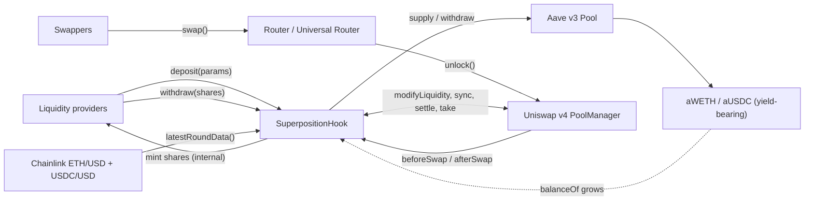
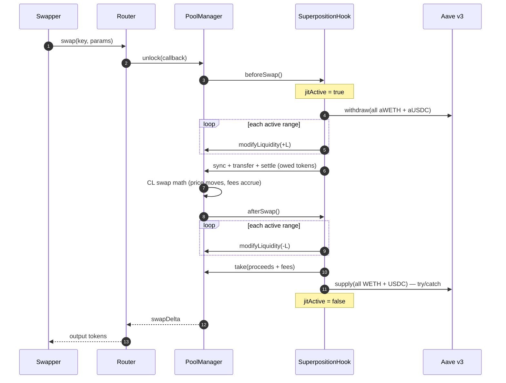
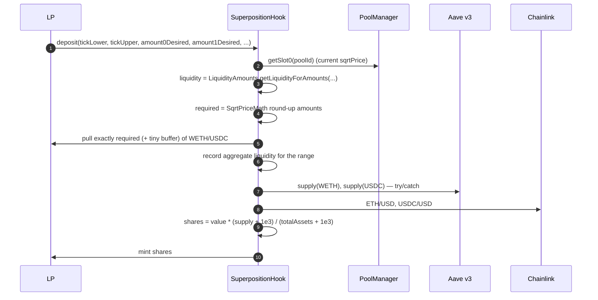
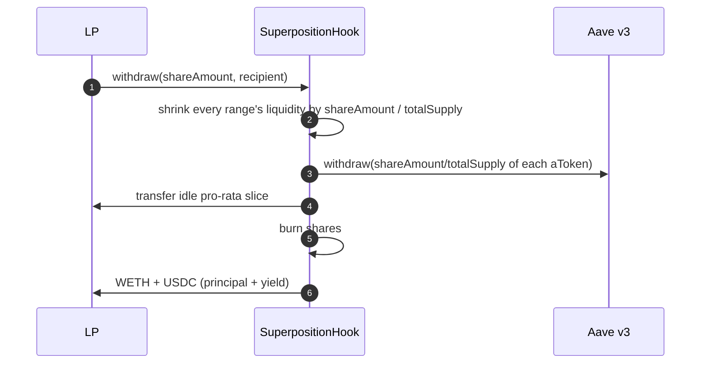
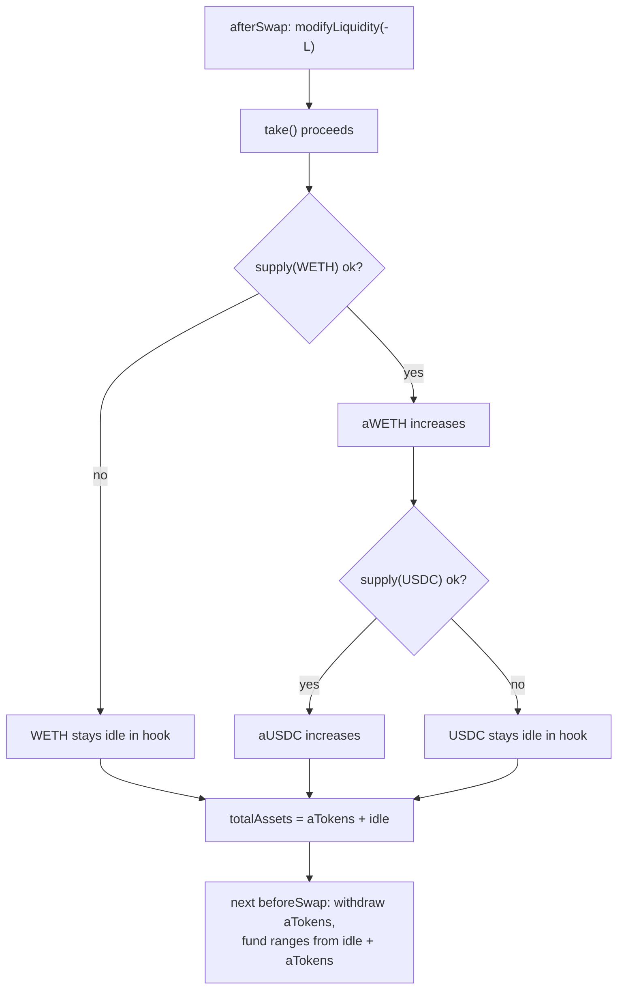
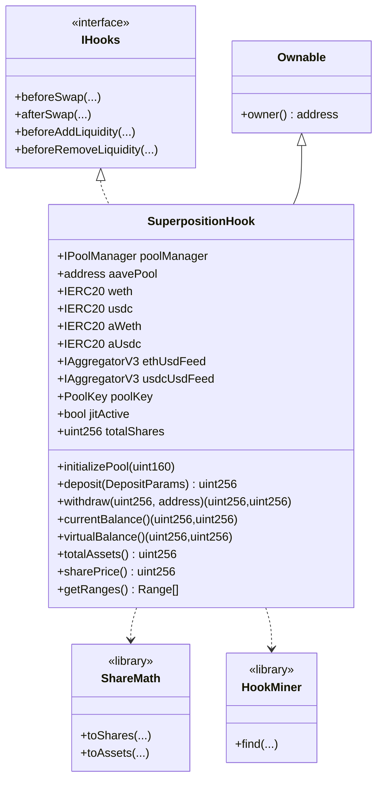
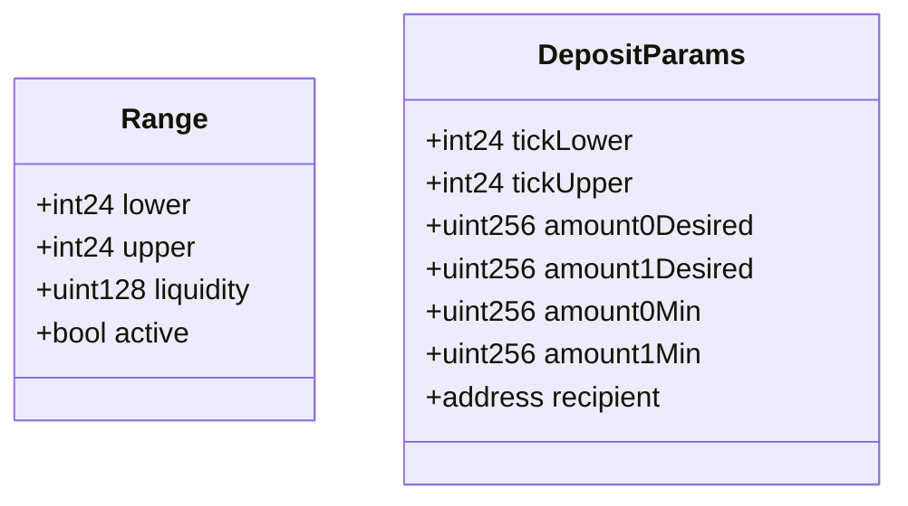

<p align="center">
  <strong>Superposition</strong><br/>
  Yield-backed concentrated liquidity on Uniswap v4
</p>

<p align="center">
  
  
  
  
  
  
</p>

> **Deployment target: Base Sepolia (chain id 84532) — TESTNET.** The contract is additionally
> fork-tested on Base mainnet as a reference.

A Uniswap v4 concentrated-liquidity hook whose capital sits **100% in Aave v3** between
swaps. Liquidity is *virtual*: real v4 positions are materialized for the duration of a swap
transaction, then unwound and re-deposited into Aave. LPs receive **ERC-4626-style internal
shares**, so Aave yield belongs only to the shares that were present while it accrued.

- **Idle capital? Zero.** Every deposited token is a yield-bearing `aToken` between swaps.
- **Normal v4 surface.** Ticks, price impact, fees and one-sided limit orders behave exactly
  like a standard Uniswap v4 CL pool.
- **Fair yield accounting.** An atomic deposit → withdraw earns nothing; a long-term LP keeps
  the yield their capital generated.

---

## Table of contents

1. [The insight](#1-the-insight-liquidity-can-be-virtual)
2. [Architecture](#2-architecture)
3. [Lifecycle: swap (JIT)](#3-lifecycle-swap-jit)
4. [Lifecycle: deposit & withdraw](#4-lifecycle-deposit--withdraw)
5. [The share model (ERC-4626)](#5-the-share-model-erc-4626)
6. [Concentrated liquidity & limit orders](#6-concentrated-liquidity--limit-orders)
7. [Failure handling: mixed real + virtual](#7-failure-handling-mixed-real--virtual)
8. [Uniswap v4 integration](#8-uniswap-v4-integration)
9. [Aave integration](#9-aave-integration)
10. [Contracts (UML)](#10-contracts-uml)
11. [API reference](#11-api-reference)
12. [Invariants](#12-invariants)
13. [Security](#13-security)
14. [Testing](#14-testing)
15. [Deployment](#15-deployment)
16. [Repository layout](#16-repository-layout)
17. [Limitations & roadmap](#17-limitations--roadmap)

---

## 1. The insight: liquidity can be virtual

In a normal v4 pool, LP tokens sit in the `PoolManager` and earn nothing while idle. Here the
`PoolManager`'s view of the pool and the location of the capital are separated:

- The **pool's `liquidity`** (what the AMM prices against) is reconstructed around each swap.
- The **capital** lives in Aave as `aWETH`/`aUSDC`, accruing yield the whole time.

Nothing is lost in the exchange. The only moment tokens are not in Aave is the duration of a
single swap transaction, so Aave's utilization (and therefore its rate) is effectively
unaffected by the hook.

---

## 2. Architecture



**Separation of concerns**

| Layer | Responsibility |
|---|---|
| `PoolManager` | v4 CL math, tick state, deltas, settlement |
| `SuperpositionHook` | Vault, shares, range bookkeeping, JIT lifecycle, Aave custody |
| Aave v3 | Yield on 100% of idle capital |
| Chainlink | Deposit-time USD valuation of the two-asset vault |

---

## 3. Lifecycle: swap (JIT)

Between swaps the pool holds **zero real token liquidity** — everything is in Aave. The hook
materializes the ranges in `beforeSwap` and reverses it in `afterSwap`, all inside the
`PoolManager`'s lock.



**Why this settles cleanly.** `modifyLiquidity(-L)` credits the hook a positive delta, and
`take` zeroes it *before* the Aave supply leg runs. The supply is wrapped in `try/catch`, so even
if it reverts, every `PoolManager` delta is already zero and `nonZeroDeltaCount == 0` when the
lock closes. A failed supply can only leave idle ERC-20 in the hook — never an unsettled delta.

---

## 4. Lifecycle: deposit & withdraw

**Deposit** — pulls only the tokens the requested range actually needs, supplies them to Aave,
and mints shares against a Chainlink USD valuation.



**Withdraw** — burns shares and pays a pro-rata slice of *real* balances, so no oracle is needed
on exit.



---

## 5. The share model (ERC-4626)

The vault holds **two** assets, so shares are minted against one scalar value.

```solidity
totalAssets() = aWETH.balanceOf(hook) * ethUsd / 1e8          // WETH, 18 decimals
              + aUSDC.balanceOf(hook) * usdcUsd * 1e12 / 1e8  // USDC, 6 decimals
              + idle WETH/USDC (if an Aave supply failed)
```

```solidity
shares = assetsIn * (totalSupply + VIRTUAL_SHARES) / (totalAssetsBefore + VIRTUAL_ASSETS)
assetsOut = shares * (totalAssets + VIRTUAL_ASSETS) / (totalSupply + VIRTUAL_SHARES)
```

- `VIRTUAL_SHARES = VIRTUAL_ASSETS = 1e3` bound the classic empty-vault donation/inflation attack.
- On Base, Aave is v3.2, so `aToken.balanceOf` is **already index-accrued** — the balance itself
  grows and no index math is needed.
- Exit needs **no price**: `withdraw` returns `shares / totalSupply` of each real balance.

### Worked example

| Step | totalAssets | totalSupply | Bob | Alice |
|---|---|---|---|---|
| Bob deposits $5,000 | $5,000 | 5,000 | 5,000 shares | — |
| Aave yield: +$50 | $5,050 | 5,000 | 5,000 shares | — |
| Alice deposits $1,000 | $6,050 | 6,050 | 5,000 shares | 1,000 shares |
| Alice exits immediately | $5,050 | 5,000 | 5,000 shares | 0 |

Alice receives ≈ $1,000 back (she bought and sold at the same price). The $50 of yield stays
with Bob. That is the whole point: **join → exit cannot skim accrued yield**.

### Why a price is needed at all

Merging `aWETH` and `aUSDC` into a single `totalAssets` requires a relative price; otherwise a
5,000 USDC deposit into a `10 WETH + 30,000 USDC` vault has no defined share count. Chainlink is
used (rather than the v4 spot price) so minting cannot be sandwiched through the pool.

---

## 6. Concentrated liquidity & limit orders

A range fully below spot needs only token1 (USDC); a range fully above spot needs only token0
(WETH). Because deposits pull `SqrtPriceMath` round-up amounts for the requested range, a
one-sided, out-of-range deposit is a real limit order:

```solidity
// USDC-only bid below spot: pull 0 WETH
hook.deposit(DepositParams({
    tickLower: lower,
    tickUpper: upper,          // upper < currentTick
    amount0Desired: 0,         // no WETH
    amount1Desired: 3_000e6,   // USDC only
    amount0Min: 0, amount1Min: 0,
    recipient: alice
}));
```

When a swap pushes the price into that range, the position fills: the vault sells USDC and
acquires WETH. There is no separate "order" object — the range itself is the order.

> The deposit pulls `required + DEPOSIT_BUFFER` where `DEPOSIT_BUFFER = 1000` wei, and reserves
> that buffer inside `amountDesired`. Aave's liquidity index rounds `balanceOf` down by ≤1 wei per
> supply, and the hook re-supplies every swap; the buffer absorbs that drift for thousands of
> cycles and each deposit refreshes it.

---

## 7. Failure handling: mixed real + virtual

Aave can reject a supply (supply cap, frozen reserve, paused market). That is expected and
handled:



The vault is always solvent because `totalAssets()` counts **both** layers, and every range is
funded from idle **plus** withdrawn aTokens on the next swap. The pool behaves as though the
real and virtual balances are one — because at swap time they are.

Aave's `supply` is all-or-nothing (it reverts rather than partially filling), so a cap hit parks
the whole amount idle and yield-bearing again as soon as capacity returns. Partial deployment up
to a cap headroom is a possible extension (see [roadmap](#17-limitations--roadmap)).

---

## 8. Uniswap v4 integration

### Hook permission bits

v4 decides which callbacks to invoke from the **low 14 bits of the hook address**, and
`PoolManager.initialize` reverts `HookAddressNotValid` unless they match. The hook enables:

| Callback | Flag | Why |
|---|---|---|
| `beforeAddLiquidity` | `1 << 11` | reject anyone but the hook from LPing the pool |
| `beforeRemoveLiquidity` | `1 << 9` | same |
| `beforeSwap` | `1 << 7` | JIT materialize ranges + settle |
| `afterSwap` | `1 << 6` | JIT remove ranges, take, re-supply to Aave |

`HookMiner` mirrors Uniswap's official implementation: it searches a CREATE2 salt so the deployed
address encodes those bits (`Hooks.ALL_HOOK_MASK`, bounded loop, `code.length` check). Deployment
goes through the Arachnid CREATE2 proxy (`0x4e59b448…4956C`) so the address is deterministic.

### Delta settlement

- `beforeSwap` accumulates the negative deltas of all `modifyLiquidity(+L)` calls and settles
  them once per currency via `sync → transfer → settle`.
- `afterSwap` accumulates the positive deltas of all `modifyLiquidity(-L)` calls and `take`s them
  once per currency.
- All hook deltas are zero inside the lock, so the global `nonZeroDeltaCount` invariant holds.

### Access control

- Every callback is `onlyPoolManager`.
- `beforeAddLiquidity` / `beforeRemoveLiquidity` additionally require `sender == address(this)`,
  so third parties cannot bypass the vault and LP the pool directly.
- Deposits and withdrawals revert while `jitActive`, preventing re-entrancy during the JIT window.

---

## 9. Aave integration

- `supply` and `withdraw` only; the hook **never borrows**.
- `aWETH` / `aUSDC` are held by the hook. On Aave v3.2 `balanceOf` is index-accrued, so the
  displayed balance grows with yield and is directly the underlying amount.
- Every `supply` is wrapped in `try/catch`; on failure the approval is reset and tokens stay idle.
- `withdraw` is bounded by Aave's available liquidity, so very large exits may need batching.

---

## 10. Contracts (UML)





---

## 11. API reference

### `deposit(DepositParams) → uint256 sharesMinted`

Computes range liquidity, pulls exactly the required WETH/USDC (+ buffer), records the aggregate
liquidity for `(tickLower, tickUpper)`, supplies to Aave (try/catch) and mints shares.

Reverts: `JitActive`, `PoolNotInitialized`, `InvalidRange` (bad tick order or not a multiple of
`tickSpacing`), `NoLiquidity`, `Slippage`, `ZeroShares`.

### `withdraw(uint256 shareAmount, address recipient) → (uint256 wethOut, uint256 usdcOut)`

Shrinks all ranges proportionally, withdraws the pro-rata slice of each `aToken` plus idle
balances, and burns the shares. Reverts: `JitActive`, `ZeroShares`, `InsufficientShares`.

### Views

| Function | Returns |
|---|---|
| `currentBalance()` | real `(WETH, USDC)` = aTokens + idle |
| `virtualBalance()` | range composition at the current price |
| `totalAssets()` | USD value (1e18) of real holdings |
| `sharePrice()` | assets per 1e18 shares |
| `convertToShares(uint256)` / `convertToAssets(uint256)` | share conversions |
| `balanceOf(address)` / `totalSupply()` | share accounting |
| `getRanges()` | array of active `Range` |

### Events

```solidity
event Deposited(address indexed recipient, int24 lower, int24 upper,
                uint128 liquidity, uint256 amount0, uint256 amount1, uint256 shares);
event Withdrawn(address indexed owner, address indexed recipient,
                uint256 shares, uint256 amount0, uint256 amount1);
```

### Errors

`NotPoolManager`, `HookNotImplemented`, `OnlyHook`, `JitActive`, `NoLiquidity`, `Slippage`,
`InvalidRange`, `PoolNotInitialized`, `AlreadyInitialized`, `ZeroShares`, `InsufficientShares`,
`StalePrice`.

---

## 12. Invariants

- `totalSupply == Σ balanceOf(account)`.
- `currentBalance() == aTokens + idle` for each token.
- The vault is solvent: `Σ convertToAssets(balanceOf(u)) ≤ totalAssets()`.
- At swap time the pool is funded by `idle + aTokens`, so the CL depth equals the aggregate
  recorded range liquidity.
- All hook `PoolManager` deltas are zero when the lock closes.

---

## 13. Security

| Concern | Mitigation |
|---|---|
| Share-price manipulation | valuation via Chainlink, not the manipulable v4 spot price |
| Empty-vault inflation / donation | `VIRTUAL_SHARES` + `VIRTUAL_ASSETS` offsets |
| Re-entrancy during JIT | `jitActive` guard on `deposit` / `withdraw` |
| Unauthorized LPing | `beforeAddLiquidity` / `beforeRemoveLiquidity` require `sender == hook` |
| Hook callback spoofing | every callback is `onlyPoolManager` |
| Aave supply failure | `try/catch`; tokens stay idle and counted |
| Insolvency via accounting drift | exit pays a pro-rata slice of real balances only |
| Aave index rounding | `DEPOSIT_BUFFER` absorbs ≤1 wei/supply drift |
| Stale/malformed feed | `_price` reverts on non-positive or zero-timestamp rounds |

---

## 14. Testing

`forge test` — **25 tests passing** across two forks with real contracts (Uniswap v4, Aave v3,
Chainlink), no mocks except a forced Aave failure.

- `BaseSepoliaForkTest` — **the deployment target: Base Sepolia (chain id 84532, TESTNET)**
- `SuperpositionHookBaseForkTest` — Base mainnet fork (reference, deeper market)

| Test | Proves |
|---|---|
| `test_initial_views` | clean initial state |
| `test_fork_deposit_two_sided` | range liquidity, aToken custody, zero idle |
| `test_fork_withdraw_returns_principal` | full exit returns principal |
| `test_fork_withdraw_half` | proportional range reduction |
| `test_fork_swap_jit_cycle` | full JIT swap, price move, capital back in Aave |
| `test_fork_one_sided_usdc_limit_order` | USDC-only out-of-range deposit |
| `test_fork_limit_order_fills_on_cross` | the limit order fills when price crosses |
| `test_fork_yield_accrual_and_atomic_exit_fairness` | atomic join/exit earns no yield |
| `test_fork_deposit_survives_aave_failure` | try/catch fallback with idle tokens |
| `test_fork_partial_aave_supply_stays_correct` | mixed real + virtual after a failed supply |
| `test_fork_withdraw_after_swap` | withdraw works after a swap |
| `test_fork_multi_lp_full_exit` | two LPs fully drain the vault |
| `test_non_manager_hook_calls_revert` | callback access control |
| `test_direct_lp_modify_reverts` | direct LPing is rejected |
| `LiquidityAmounts.t.sol`, `ShareMath.t.sol` | one-sided math and share math |

**Base Sepolia testnet suite** (the deployment target)

| Test | Proves |
|---|---|
| `test_sepolia_deploy_and_deposit` | hook deploys, pool initializes, deposit reaches Aave |
| `test_sepolia_jit_swap` | full JIT swap on the testnet stack |
| `test_sepolia_withdraw` | pro-rata exit on the testnet stack |
| `test_sepolia_usdc_only_limit_order` | one-sided USDC limit order on the testnet stack |

---

## 15. Deployment

> **TESTNET.** The deployment target is **Base Sepolia (chain id 84532)**. The script reverts on
> any other chain id. On Base Sepolia the vault uses **Aave's USDC test asset** (`0xba50Cd2A…d4D5f`),
> not the Circle USDC (`0x036CbD…`), because that is the token the Aave reserve supports.

```bash
forge script script/DeployHook.s.sol --rpc-url base_sepolia --broadcast --private-key <KEY>
```

The script mines the permission salt, deploys through the deterministic CREATE2 proxy, and
initializes the WETH/USDC pool at the price implied by the live Chainlink feeds.

**Base Sepolia (84532, TESTNET) addresses**

| Contract | Address |
|---|---|
| v4 `PoolManager` | `0x05E73354cFDd6745C338b50BcFDfA3Aa6fA03408` |
| Aave v3 `Pool` | `0x8bAB6d1b75f19e9eD9fCe8b9BD338844fF79aE27` |
| WETH / aWETH | `0x4200…0006` / `0x73a5bB60b0B0fc35710DDc0ea9c407031E31Bdbb` |
| USDC (Aave test) / aUSDC | `0xba50Cd2A20f6DA35D788639E581bca8d0B5d4D5f` / `0x10F1A9D11CDf50041f3f8cB7191CBE2f31750ACC` |
| Chainlink ETH/USD | `0x4aDC67696bA383F43DD60A9e78F2C97Fbbfc7cb1` |
| Chainlink USDC/USD | `0xd30e2101a97dcbAeBCBC04F14C3f624E67A35165` |
| CREATE2 deployer | `0x4e59b44847b379578588920cA78FbF26c0B4956C` |

Pool: WETH `currency0`, USDC `currency1`, fee `500`, tickSpacing `10`.

For reference, the contract was also validated on a **Base mainnet fork** (v4 `0x4985…2b2b`,
Aave `0xA238…1c5`, Circle USDC `0x8335…2913`). The mainnet fork suite is kept in the repo; the
deployment script targets Base Sepolia.

## Build

```bash
git clone --recursive <repo>
cd <repo>            # or: cd superposition-uni-v4-hook
forge build
forge test
```

---

## 16. Repository layout

```
src/
  SuperpositionHook.sol        hook + vault (deposits, withdrawals, JIT, shares)
  libraries/
    ShareMath.sol              ERC-4626 share math with virtual offsets
    HookMiner.sol              CREATE2 salt search for v4 permission bits
  interfaces/
    IAavePool.sol              Aave v3 pool subset
    IAggregatorV3.sol          Chainlink feed subset
test/
  BaseSepoliaFork.t.sol            Base Sepolia TESTNET fork suite (deployment target)
  SuperpositionHookBaseFork.t.sol  Base mainnet fork suite (reference)
  LiquidityAmounts.t.sol           canonical periphery math
  ShareMath.t.sol                  share math
  helpers/TestSwapRouter.sol       minimal v4 swap router for tests
script/
  BaseSepoliaAddresses.sol     verified Base Sepolia (TESTNET) addresses
  DeployHook.s.sol             deterministic testnet deployment (chain-guarded)
```

---

## 17. Limitations & roadmap

- **Two-asset valuation** is currently WETH/USDC (two Chainlink feeds); a feed registry would
  generalize it to any pair.
- **Partial Aave deployment** up to a supply-cap headroom (instead of all-or-nothing) is a natural
  extension.
- **Multi-pair factory** and an **external adapter** exposing the vault shares are future work.
- Large exits bounded by Aave liquidity may need batching.

---

## License

MIT
