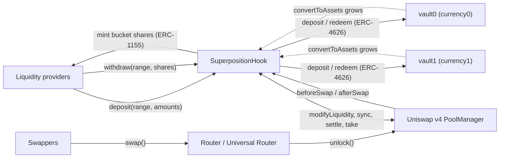
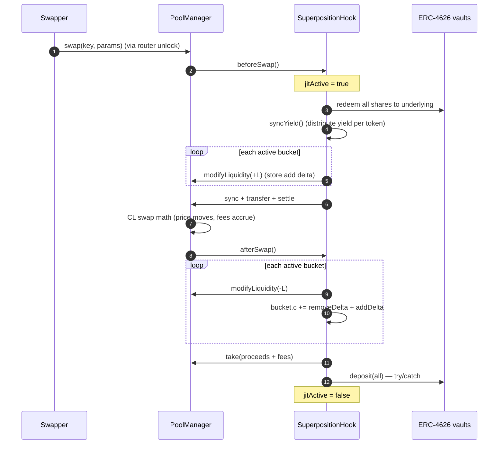
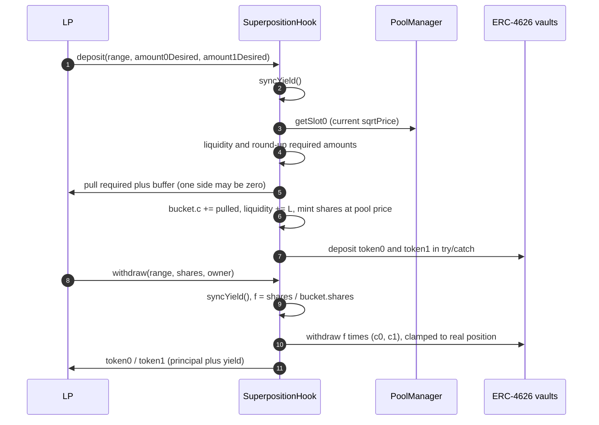
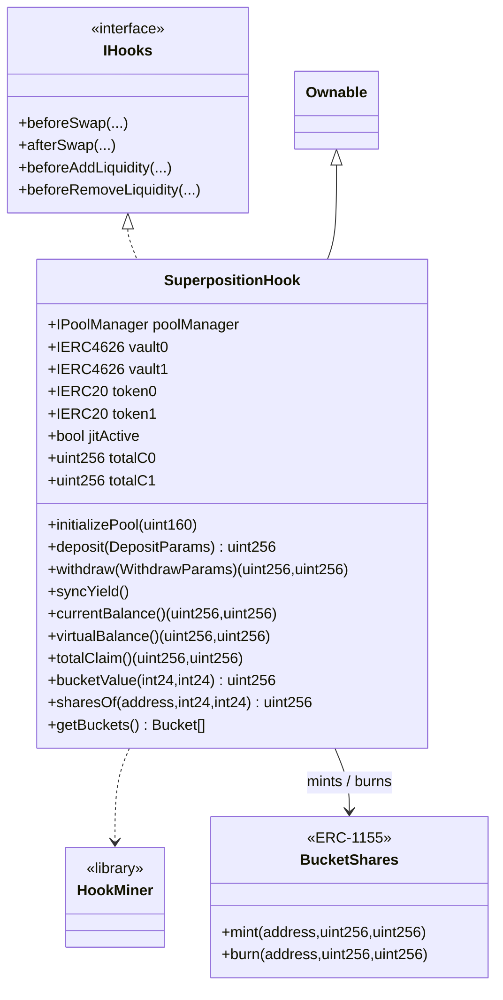

<p align="center">
  <strong>Superposition</strong><br/>
  Yield-backed concentrated liquidity on Uniswap v4
</p>

<p align="center">
  
  
  
  
  
  
</p>

> **Deployment target: Base Sepolia (chain id 84532) — TESTNET.** Also fork-tested on Base mainnet.

A Uniswap v4 concentrated-liquidity hook whose capital sits **100% in two external ERC-4626
lending vaults** (one per side) between swaps. The hook is **protocol-agnostic**: it only talks
ERC-4626, so either side can be a Morpho MetaMorpho vault, an Euler v2 EVault, a Spark Savings
vault, a Yearn vault, or an Aave ERC-4626 wrapper — in any combination. The pool's two currencies
are read from `vault.asset()`, so **any token pair** works, not just a specific one.

Liquidity is *virtual*: real v4 positions are materialized for the duration of a swap transaction,
then unwound and re-deposited into the vaults. Ownership is tracked **per tick range** (a
"bucket"), so an out-of-range, one-sided deposit is a real **limit order** and can be withdrawn
one-sided. Yield is attributed per token to the bucket that held it. No external oracle is used.

- **Idle capital? Zero.** Every token earns the vault's yield between swaps.
- **Normal v4 surface.** Ticks, price impact and fees behave exactly like a standard v4 CL pool.
- **One-sided in, one-sided out.** A token1 bid below spot stays token1 (or becomes token0 once filled).
- **Transferable shares.** Ownership is an ERC-1155 token (one id per range), transferable and
  delegate-able: an approved operator can withdraw capital + yield.
- **Fair yield.** Atomic join → exit returns exactly the principal; swap PnL + fees land on the
  range that produced them.

---

## Table of contents

1. [The insight](#1-the-insight-liquidity-can-be-virtual)
2. [Architecture](#2-architecture)
3. [Lifecycle: swap (JIT)](#3-lifecycle-swap-jit)
4. [Lifecycle: deposit & withdraw](#4-lifecycle-deposit--withdraw)
5. [Per-range buckets, shares and yield](#5-per-range-buckets-shares-and-yield)
6. [Limit orders](#6-limit-orders)
7. [Lending backends](#7-lending-backends)
8. [Uniswap v4 integration](#8-uniswap-v4-integration)
9. [Failure handling: mixed real + virtual](#9-failure-handling-mixed-real--virtual)
10. [Contracts (UML)](#10-contracts-uml)
11. [API reference](#11-api-reference)
12. [Invariants](#12-invariants)
13. [Security](#13-security)
14. [Testing](#14-testing)
15. [Deployment](#15-deployment)
16. [Repository layout](#16-repository-layout)
17. [Limitations & roadmap](#17-limitations--roadmap)

---

## 1. The insight: liquidity can be virtual

In a normal v4 pool, LP tokens sit in the `PoolManager` and earn nothing while idle. Here the
pool's view and the location of the capital are separated:

- The **pool's `liquidity`** (what the AMM prices against) is reconstructed around each swap.
- The **capital** lives in the two ERC-4626 vaults, accruing their yield the whole time.

The only moment tokens are not in the vaults is the duration of a single swap transaction, so the
vaults' utilization (and rate) is effectively unaffected by the hook.

---

## 2. Architecture



| Layer | Responsibility |
|---|---|
| `PoolManager` | v4 CL math, tick state, deltas, settlement |
| `SuperpositionHook` | vault, per-range buckets/shares, JIT lifecycle, ERC-4626 custody |
| `vault0` / `vault1` | lending yield on 100% of idle capital (any ERC-4626) |

---

## 3. Lifecycle: swap (JIT)

Between swaps the pool holds **zero real liquidity** — everything is in the vaults. `beforeSwap`
materializes every bucket; `afterSwap` reverses it and attributes PnL.



**Why this settles cleanly.** Removing a bucket credits the hook a positive delta which `take`
zeroes *before* the vault deposit leg runs. The deposit is `try/catch`-wrapped, so even if it
reverts, every `PoolManager` delta is already zero and `nonzeroDeltaCount == 0` when the lock
closes.

---

## 4. Lifecycle: deposit & withdraw



---

## 5. Per-range buckets, shares and yield

Each distinct `(tickLower, tickUpper)` is a **bucket**:

```solidity
struct Bucket {
    int24   lower;
    int24   upper;
    uint128 liquidity;   // total v4 CL liquidity in this range
    uint256 shares;      // total internal shares of this bucket
    uint256 c0;          // token0 claim (underlying, incl. yield)
    uint256 c1;          // token1 claim (underlying, incl. yield)
    bool    active;
}
```

Within a bucket shares are fungible; across buckets they are independent. Shares are the
**`BucketShares` ERC-1155 token**, one id per range
(`uint256(keccak256(abi.encodePacked(lower, upper)))`); they are transferable and support
`setApprovalForAll`, so a delegate contract can withdraw on the owner's behalf. This is what makes a
one-sided, out-of-range order able to exit one-sided.

### 5.1 Minting at the pool price (no external oracle)

`value(x0, x1, p) = x1 + x0 * p`, where `p = (sqrtPriceX96 / 2^96)^2` is the current pool price.

```
sharesMinted = value(pulled0, pulled1) * bucket.shares / value(bucket.c0, bucket.c1)
```

Because the deposit is priced with the same AMM price as the bucket, an atomic deposit → withdraw
returns exactly the principal, and existing yield is not diluted. One-sided buckets need no price
at all.

### 5.2 Yield, per token and uniform

`_syncYield()` distributes `R - Σc` for each token pro-rata to each bucket's claim, where
`R = vault.convertToAssets(vault.balanceOf(hook)) + idle`. So an in-range two-sided LP earns both
tokens in proportion to its composition; a one-tick token1 order earns the token1 yield while it
rests and the token0 yield on the token it acquires after a fill; an atomic entrant earns nothing.

### 5.3 Swap PnL per bucket

`beforeSwap` stores each bucket's add delta; `afterSwap` applies the removal delta:

```
bucket.c += removeDelta + addDelta     // principal change + fees
```

so `Σ c == R` after every cycle, and a range that was filled is the only one that changes.

---

## 6. Limit orders

A range fully below spot needs only token1; a range fully above spot needs only token0. Because
the deposit pulls exactly the range-required amounts, a one-sided, out-of-range deposit is a real
limit order, and a 1-tick-wide range is the most capital-efficient form of it. The pool's
`tickSpacing` sets the narrowest range (use `tickSpacing = 1` for a true 1-tick order).

```solidity
// token1-only bid just below spot (WETH/USDC used here only as an example pair)
hook.deposit(DepositParams({
    tickLower: lower,
    tickUpper: upper,          // upper < currentTick
    amount0Desired: 0,         // no token0
    amount1Desired: someUsdc,  // token1 only
    amount0Min: 0, amount1Min: 0,
    recipient: alice
}));
```

When a swap pushes the price into the range, the bucket sells token1 and acquires token0; a
withdrawal then pays token0. There is no order object — the range is the order.

The deposit pulls `required + DEPOSIT_BUFFER` (1000 wei) to absorb ERC-4626 share/asset rounding.

---

## 7. Lending backends

The hook accepts **any ERC-4626 vault pair**. It reads only `vault.asset()`, `vault.balanceOf()`,
`convertToAssets()`, and calls `deposit` / `withdraw` / `redeem`. There is no protocol branch.

| Backend | ERC-4626 | Notes |
|---|---|---|
| **Morpho** (MetaMorpho V1 / Vault V2) | yes | `maxWithdraw` may return 0 on V2, so the hook clamps to `convertToAssets(balanceOf)` |
| **Euler v2** (EVault) | yes | ERC-4626 vault with borrowing via EVC; supply-only use here |
| **Spark Savings** (`spUSDC`, `spUSDT`, …) | yes | `withdraw`/`redeem` can revert on insufficient idle liquidity |
| **Yearn v3** / other vaults | yes | any standard vault |
| **Aave v3** | wrapper only | the core aToken is **not** ERC-4626; use the official wrapper (`waToken` / BGD `stataToken`) |

**Aave wrappers.** Aave v3 ships ERC-4626 wrappers ("Wrapped Aave" / `stataToken`) that hold the
aToken and grow in value. Pre-deployed wrappers exist on 18 networks, including Ethereum, Base,
Arbitrum, Optimism, Polygon, Avalanche, Gnosis, Scroll, Linea, Celo, Sonic, Monad and their
testnets; for any other listed asset the permissionless `STATA_FACTORY.getStaticAToken(asset)` can
mint one. The core aToken (rebasing balance) is intentionally **not** accepted, which is exactly
what keeps every side on the same, uniform ERC-4626 model across chains.

If a chain/asset has **no** ERC-4626 vault (Aave wrapper, Morpho, Euler, Spark, …), that token is
not usable with the hook there — a coverage limit, not a behavioural one.

---

## 8. Uniswap v4 integration

| Callback | Flag | Why |
|---|---|---|
| `beforeAddLiquidity` | `1 << 11` | reject anyone but the hook from LPing the pool |
| `beforeRemoveLiquidity` | `1 << 9` | same |
| `beforeSwap` | `1 << 7` | JIT materialize buckets, sync yield, settle |
| `afterSwap` | `1 << 6` | JIT remove buckets, attribute PnL/fees, re-deposit |

v4 decides which callbacks to invoke from the **low 14 bits of the hook address**, and
`PoolManager.initialize` reverts `HookAddressNotValid` unless they match. `HookMiner` mirrors
Uniswap's official implementation (CREATE2 salt search, `Hooks.ALL_HOOK_MASK`, `code.length`
check). Deployment uses the deterministic CREATE2 proxy (`0x4e59b448…4956C`).

Deltas: `beforeSwap` settles the negative deltas of all `modifyLiquidity(+L)` once per currency
(`sync → transfer → settle`); `afterSwap` accumulates the positive deltas and `take`s them. All
hook deltas are zero inside the lock. Every callback is `onlyPoolManager`, and
`beforeAddLiquidity`/`beforeRemoveLiquidity` also require `sender == address(this)`. Deposits and
withdrawals revert while `jitActive`.

---

## 9. Failure handling: mixed real + virtual

A vault can reject a deposit (cap, paused market) or a withdrawal (illiquidity). `afterSwap`
settles all v4 deltas before the deposit leg, so a caught failure leaves idle ERC-20 in the hook —
never an unsettled delta. `currentBalance()` counts both vault positions and idle, and the next
swap funds the buckets from idle **plus** redeemed underlying. The pool behaves as though real and
virtual are one, because at swap time they are.

ERC-4626 `deposit` mints shares rounded down and `withdraw` rounds assets up; the `DEPOSIT_BUFFER`
and the withdrawal clamp handle those few wei.

---

## 10. Contracts (UML)



---

## 11. API reference

### Constructor

```solidity
constructor(
    IPoolManager poolManager,
    IERC4626 vault0,        // asset() must be < asset() of vault1
    IERC4626 vault1,
    uint24 fee,
    int24 tickSpacing,
    address initialOwner
)
```

The pool currencies are `token0 = vault0.asset()` and `token1 = vault1.asset()`; they must be
sorted ascending (v4 requires `currency0 < currency1`). No token addresses are passed explicitly,
so the same contract serves any pair and any ERC-4626 backend.

### `deposit(DepositParams) → uint256 sharesMinted`

Computes range liquidity, pulls exactly the required tokens (+ buffer), updates the bucket
(`c`, `liquidity`, `shares`) and deposits into the vaults (try/catch). Mints shares at the pool price.

Reverts: `JitActive`, `PoolNotInitialized`, `InvalidRange`, `NoLiquidity`, `Slippage`, `ZeroShares`.

### `withdraw(WithdrawParams) → (uint256 amount0, uint256 amount1)`

`syncYield`, then burns `shareAmount / bucket.shares` of the bucket's `(c0, c1)` and reduces its
liquidity; pays from the vaults + idle, clamped to the real position. The `owner` field is whose
ERC-1155 shares are burned, callable by the owner or an ERC-1155 operator. Reverts: `JitActive`,
`ZeroShares`, `InsufficientShares`, `NoBucket`, `NotAuthorized`.

### `syncYield()`

Realizes accrued vault yield into the buckets. Idempotent; safe off the JIT window.

### Views

| Function | Returns |
|---|---|
| `currentBalance()` | real `(token0, token1)` = vault positions + idle |
| `virtualBalance()` | bucket composition at the current price |
| `totalClaim()` | `(Σc0, Σc1)` |
| `bucketValue(lower, upper)` | bucket claim value in token1 terms |
| `sharesOf(user, lower, upper)` / `totalSharesOf(lower, upper)` | bucket share accounting |
| `getBuckets()` | array of `Bucket` |

### Events

```solidity
event Deposited(address indexed recipient, int24 lower, int24 upper,
                uint128 liquidity, uint256 amount0, uint256 amount1, uint256 shares);
event Withdrawn(address indexed owner, address indexed recipient, int24 lower, int24 upper,
                uint256 shares, uint256 amount0, uint256 amount1);
```

### Errors

`NotPoolManager`, `HookNotImplemented`, `OnlyHook`, `JitActive`, `NoLiquidity`, `Slippage`,
`InvalidRange`, `PoolNotInitialized`, `AlreadyInitialized`, `ZeroShares`, `InsufficientShares`,
`NoBucket`, `NotAuthorized`.

---

## 12. Invariants

- `totalC ≤ R` per token, where `R = vault position + idle`.
- `bucket.shares` is conserved by yield and swaps (only deposits/withdrawals change it), so value
  per share grows with yield.
- Swap PnL and fees land only on the bucket that was crossed.
- All hook `PoolManager` deltas are zero when the lock closes.
- No external oracle: valuation uses only the v4 pool price; one-sided buckets need none.

---

## 13. Security

| Concern | Mitigation |
|---|---|
| Yield theft by atomic join/exit | shares minted at the pool price; `c` does not move within a tx |
| Cross-range PnL leak | per-bucket add/remove deltas from the PoolManager |
| Re-entrancy during JIT | `jitActive` guard on `deposit` / `withdraw` / `syncYield` |
| Unauthorized LPing | `beforeAddLiquidity` / `beforeRemoveLiquidity` require `sender == hook` |
| Hook callback spoofing | every callback is `onlyPoolManager` |
| Vault deposit failure | `try/catch`; tokens stay idle and counted |
| Vault rounding | `DEPOSIT_BUFFER` + withdrawal clamped to the real position |
| Insolvency via accounting drift | cached totals only grow; payouts clamped to holdings |

---

## 14. Testing

`forge test` — **23 tests passing** across two forks with **real contracts** (Uniswap v4 + real
ERC-4626 vaults), no mocks except forced vault failures.

- `BaseSepoliaForkTest` — **the deployment target**, using Aave's real ERC-4626 wrappers.
- `SuperpositionHookBaseForkTest` — Base mainnet, including a **mixed** pool (`waWETH` + Morpho USDC).

| Test | Proves |
|---|---|
| `test_fork_deposit_two_sided` | bucket liquidity, vault custody, zero idle |
| `test_fork_withdraw_returns_principal` / `_half` | one-sided-correct pro-rata exit |
| `test_fork_swap_jit_cycle` | full JIT swap, price move, capital back in the vaults |
| `test_fork_one_sided_usdc_limit_order` / `..._fills_on_cross` | one-sided limit orders |
| `test_fork_yield_accrual_and_atomic_exit_fairness` | atomic join/exit earns no yield |
| `test_fork_deposit_survives_vault_failure` | try/catch fallback with idle tokens |
| `test_fork_partial_vault_deposit_stays_correct` | mixed real + virtual after a failed deposit |
| `test_fork_mixed_vaults_aave_morpho` | one Aave side, one Morpho side, same hook |
| `test_fork_multi_lp_full_exit`, `test_fork_delegate_withdraw` | lifecycle + ERC-1155 operator |
| `test_non_manager_hook_calls_revert`, `test_direct_lp_modify_reverts` | access control |

---

## 15. Deployment

> **TESTNET.** Target is **Base Sepolia (chain id 84532)**; the script reverts on any other chain.

```bash
forge script script/DeployHook.s.sol --rpc-url base_sepolia --broadcast --private-key <KEY>
```

**Base Sepolia (84532, TESTNET) addresses**

| Item | Address |
|---|---|
| v4 `PoolManager` | `0x05E73354cFDd6745C338b50BcFDfA3Aa6fA03408` |
| vault0 (Wrapped Aave WETH) | `0xde7820fFb73059608928cb9e29F6EB1369Ad1342` |
| vault1 (Wrapped Aave USDC) | `0xf430cb6E2b85f99222fBFA6dFEa18Ff60FA6B32a` |
| WETH / USDC (underlyings) | `0x4200…0006` / `0xba50Cd2A20f6DA35D788639E581bca8d0B5d4D5f` |
| CREATE2 deployer | `0x4e59b44847b379578588920cA78FbF26c0B4956C` |

**Base mainnet (8453) reference vaults**

| Item | Address |
|---|---|
| vault0 (Wrapped Aave WETH) | `0xe298b938631f750DD409fB18227C4a23dCdaab9b` |
| vault1 (Wrapped Aave USDC) | `0xC768c589647798a6EE01A91FdE98EF2ed046DBD6` |
| Morpho USDC (mixed tests) | `0xBEEFE94c8aD530842bfE7d8B397938fFc1cb83b2` |

Pool currency pair is whatever the two vaults' assets are; fee/spacing configurable (500 / 10 by
default). Chainlink is used **only in the deploy script** to pick the starting price; the hook never
reads an oracle.

## Build

```bash
git clone --recursive <repo>
cd <repo>
forge build
forge test
```

---

## 16. Repository layout

```
src/
  SuperpositionHook.sol        hook + vault (buckets, JIT, ERC-4626, yield)
  BucketShares.sol             ERC-1155 share token, one id per range
  libraries/
    HookMiner.sol              CREATE2 salt search for v4 permission bits
  interfaces/
    IAggregatorV3.sol          Chainlink feed subset (deploy scripts only)
test/
  BaseSepoliaFork.t.sol            Base Sepolia TESTNET fork suite (deployment target)
  SuperpositionHookBaseFork.t.sol  Base mainnet fork suite (incl. mixed Aave/Morpho)
  LiquidityAmounts.t.sol           canonical periphery math
  helpers/TestSwapRouter.sol       minimal v4 swap router for tests
script/
  BaseSepoliaAddresses.sol     verified Base Sepolia (TESTNET) addresses
  DeployHook.s.sol             deterministic testnet deployment (chain-guarded)
```

---

## 17. Limitations & roadmap

- **Vault coverage.** A token is usable only where an ERC-4626 vault for it exists (Aave wrapper,
  Morpho, Euler, Spark, Yearn, or one minted via `STATA_FACTORY`).
- **Pool-price valuation.** Manipulating the pool right before a deposit is a residual concern for
  two-sided in-range buckets (one-sided buckets need no price); a TWAP would harden it.
- **Partial vault deposit** up to a cap (instead of all-or-nothing).
- **Multi-pair factory** and an **external adapter** exposing each bucket position.
- Large exits bounded by vault liquidity may need batching.

---

## License

MIT
