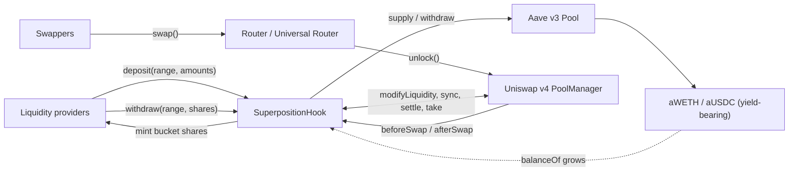
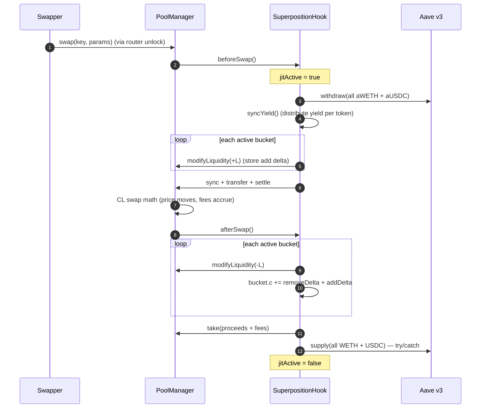
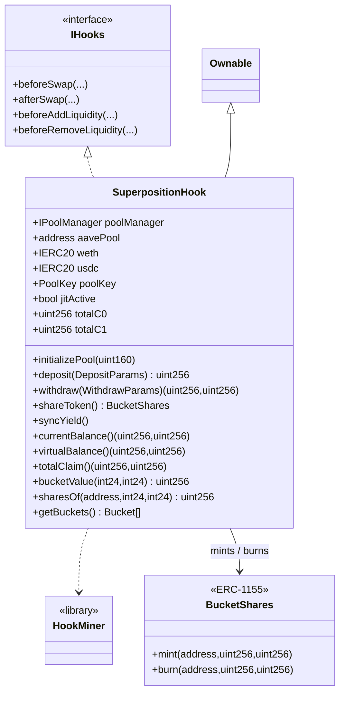
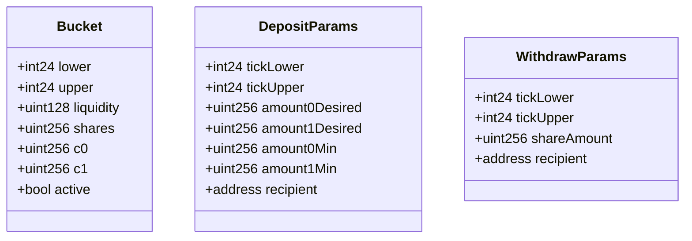

<p align="center">
  <strong>Superposition</strong><br/>
  Yield-backed concentrated liquidity on Uniswap v4
</p>

<p align="center">
  
  
  
  
  
  
</p>

> **Deployment target: Base Sepolia (chain id 84532) — TESTNET.** Also fork-tested on Base mainnet.

A Uniswap v4 concentrated-liquidity hook whose capital sits **100% in Aave v3** between swaps.
Liquidity is *virtual*: real v4 positions are materialized for the duration of a swap transaction,
then unwound and re-supplied to Aave. Ownership is tracked **per tick range** (a "bucket"), so an
out-of-range, one-sided deposit is a real **limit order** and can be withdrawn one-sided. Aave
yield is attributed per token to the bucket that held it — **no external oracle** is used.

- **Idle capital? Zero.** Every token is a yield-bearing `aToken` between swaps.
- **Normal v4 surface.** Ticks, price impact and fees behave exactly like a standard v4 CL pool.
- **One-sided in, one-sided out.** A USDC bid below spot stays USDC (or becomes WETH once filled).
- **Transferable shares.** Ownership is an ERC-1155 token (one id per range), so a position can be
  transferred or delegated to an approved operator that withdraws capital + yield.
- **Fair yield.** Atomic join → exit returns exactly the principal; yield accrues only to shares that
  were present, and swap PnL + fees land on the range that produced them.

---

## Table of contents

1. [The insight](#1-the-insight-liquidity-can-be-virtual)
2. [Architecture](#2-architecture)
3. [Lifecycle: swap (JIT)](#3-lifecycle-swap-jit)
4. [Lifecycle: deposit & withdraw](#4-lifecycle-deposit--withdraw)
5. [Per-range buckets, shares and yield](#5-per-range-buckets-shares-and-yield)
6. [Limit orders](#6-limit-orders)
7. [Failure handling: mixed real + virtual](#7-failure-handling-mixed-real--virtual)
8. [Uniswap v4 integration](#8-uniswap-v4-integration)
9. [Aave integration](#9-aave-integration)
10. [Contracts (UML)](#10-contracts-uml)
11. [API reference](#11-api-reference)
12. [Invariants](#12-invariants)
13. [Security](#13-security)
14. [Testing](#14-testing)
15. [Deployment](#15-deployment)
16. [Repository layout](#16-repository-layout)
17. [Limitations & roadmap](#17-limitations--roadmap)

---

## 1. The insight: liquidity can be virtual

In a normal v4 pool, LP tokens sit in the `PoolManager` and earn nothing while idle. Here the
pool's view and the location of the capital are separated:

- The **pool's `liquidity`** (what the AMM prices against) is reconstructed around each swap.
- The **capital** lives in Aave as `aWETH`/`aUSDC`, accruing yield the whole time.

The only moment tokens are not in Aave is the duration of a single swap transaction, so Aave's
utilization (and rate) is effectively unaffected by the hook.

---

## 2. Architecture



| Layer | Responsibility |
|---|---|
| `PoolManager` | v4 CL math, tick state, deltas, settlement |
| `SuperpositionHook` | vault, per-range buckets/shares, JIT lifecycle, Aave custody |
| Aave v3 | yield on 100% of idle capital |

---

## 3. Lifecycle: swap (JIT)

Between swaps the pool holds **zero real liquidity** — everything is in Aave. `beforeSwap`
materializes every bucket; `afterSwap` reverses it and attributes PnL.



**Why this settles cleanly.** Removing a bucket credits the hook a positive delta which `take`
zeroes *before* the Aave supply leg runs. The supply is `try/catch`-wrapped, so even if it reverts,
every `PoolManager` delta is already zero and `nonZeroDeltaCount == 0` when the lock closes.

---

## 4. Lifecycle: deposit & withdraw

```mermaid
sequenceDiagram
    autonumber
    participant U as LP
    participant H as SuperpositionHook
    participant PM as PoolManager
    participant A as Aave v3
    U->>H: deposit(range, amount0Desired, amount1Desired, ...)
    H->>H: syncYield()
    H->>PM: getSlot0 (current sqrtPrice)
    H->>H: liquidity = LiquidityAmounts(...); required = SqrtPriceMath round-up
    H->>U: pull required + buffer (one side may be zero)
    H->>H: bucket.c += pulled; liquidity += L; mint shares at pool price
    H->>A: supply(WETH), supply(USDC) — try/catch
    U->>H: withdraw(range, shares)
    H->>H: syncYield(); f = shares / bucket.shares
    H->>A: withdraw(f * (c0, c1)) (clamped to real liquidity)
    H->>U: WETH / USDC (principal + yield)
```

---

## 5. Per-range buckets, shares and yield

Each distinct `(tickLower, tickUpper)` is a **bucket**:

```solidity
struct Bucket {
    int24  lower;
    int24  upper;
    uint128 liquidity;   // total v4 CL liquidity in this range
    uint256 shares;      // total internal shares of this bucket
    uint256 c0;          // WETH claim (underlying, incl. yield)
    uint256 c1;          // USDC claim (underlying, incl. yield)
    bool    active;
}
```

Within a bucket shares are fungible (several LPs in the same range share it); across buckets they
are independent. Shares are the **`BucketShares` ERC-1155 token**, one id per range
(`uint256(keccak256(abi.encodePacked(lower, upper)))`); they are transferable and support
`setApprovalForAll`, so a delegate contract can withdraw on the owner's behalf. This is what makes a
one-sided, out-of-range order able to exit one-sided.

### 5.1 Minting at the pool price (no external oracle)

`value(x0, x1, p) = x1 + x0 * p`, where `p = (sqrtPriceX96 / 2^96)^2` is the current pool price.

```
sharesMinted = value(pulled0, pulled1) * bucket.shares / value(bucket.c0, bucket.c1)
```

Because the deposit is priced with the same AMM price as the bucket, an atomic deposit → withdraw
returns exactly the principal, and existing yield is not diluted. One-sided buckets need no price
at all. Aave's `balanceOf` is index-accrued, so `c` grows with yield.

### 5.2 Yield, per token and uniform

`_syncYield()` distributes `R - Σc` for each token pro-rata to each bucket's claim:

```
yield0 = R0 - totalC0 ;  bucket.c0 += yield0 * bucket.c0 / totalC0
yield1 = R1 - totalC1 ;  bucket.c1 += yield1 * bucket.c1 / totalC1
```

So an in-range two-sided LP earns both tokens in proportion to its composition; a one-tick USDC
order earns the USDC yield while it rests and the WETH yield on the token it acquires after a fill;
an atomic entrant earns nothing.

### 5.3 Worked example

| Step | bucket c | bucket shares | Bob | Alice |
|---|---|---|---|---|
| Bob deposits 1 WETH + 2,500 USDC | 1 WETH / 2,500 USDC | 3,500 | 3,500 | — |
| Yield: +0.01 WETH, +25 USDC | 1.01 WETH / 2,525 USDC | 3,500 | 3,500 | — |
| Alice deposits at the new price | 1.02 WETH / 2,550 USDC | 3,536 | 3,500 | 36 |
| Alice exits immediately | 1.01 WETH / 2,525 USDC | 3,500 | 3,500 | 0 |

Alice receives ≈ her principal; the yield stays with Bob.

### 5.4 Swap PnL per bucket

`beforeSwap` stores each bucket's add delta; `afterSwap` applies the removal delta:

```
bucket.c += removeDelta + addDelta     // principal change + fees
```

so `Σ c == R` after every cycle, and a range that was filled is the only one that changes.

---

## 6. Limit orders

A range fully below spot needs only USDC; a range fully above spot needs only WETH. Because the
deposit pulls exactly the range-required amounts, a one-sided, out-of-range deposit is a real limit
order, and a 1-tick-wide range is the most capital-efficient form of it.

```solidity
// USDC-only bid just below spot
hook.deposit(DepositParams({
    tickLower: lower,
    tickUpper: upper,          // upper < currentTick
    amount0Desired: 0,         // no WETH
    amount1Desired: 3_000e6,   // USDC only
    amount0Min: 0, amount1Min: 0,
    recipient: alice
}));
```

When a swap pushes the price into the range, the bucket sells USDC and acquires WETH; a withdrawal
then pays WETH. There is no order object — the range is the order. Note the pool's `tickSpacing`
sets the narrowest range (use `tickSpacing = 1` for a true 1-tick order; it is a constructor
parameter). The deposit pulls `required + DEPOSIT_BUFFER` (1000 wei) to absorb Aave's per-supply
index rounding.

---

## 7. Failure handling: mixed real + virtual

Aave can reject a supply (cap, frozen reserve, paused market). `afterSwap` settles all v4 deltas
before the supply leg, so a caught failure leaves idle ERC-20 in the hook — never an unsettled
delta. `totalClaim()` and `currentBalance()` count both aTokens and idle, and the next swap funds
the buckets from idle **plus** withdrawn aTokens. The pool therefore behaves as though real and
virtual are one, because at swap time they are.

Aave's `supply` is all-or-nothing, so a cap hit parks the amount idle until capacity returns.

---

## 8. Uniswap v4 integration

| Callback | Flag | Why |
|---|---|---|
| `beforeAddLiquidity` | `1 << 11` | reject anyone but the hook from LPing the pool |
| `beforeRemoveLiquidity` | `1 << 9` | same |
| `beforeSwap` | `1 << 7` | JIT materialize buckets, sync yield, settle |
| `afterSwap` | `1 << 6` | JIT remove buckets, attribute PnL/fees, re-supply |

v4 decides which callbacks to invoke from the **low 14 bits of the hook address**, and
`PoolManager.initialize` reverts `HookAddressNotValid` unless they match. `HookMiner` mirrors
Uniswap's official implementation (CREATE2 salt search, `Hooks.ALL_HOOK_MASK`, `code.length`
check). Deployment uses the deterministic CREATE2 proxy (`0x4e59b448…4956C`).

Deltas: `beforeSwap` settles the negative deltas of all `modifyLiquidity(+L)` once per currency
(`sync → transfer → settle`); `afterSwap` accumulates the positive deltas and `take`s them. All
hook deltas are zero inside the lock. Every callback is `onlyPoolManager`, and
`beforeAddLiquidity`/`beforeRemoveLiquidity` also require `sender == address(this)`. Deposits and
withdrawals revert while `jitActive`.

---

## 9. Aave integration

- `supply` and `withdraw` only; the hook **never borrows**.
- On Aave v3.2 `aToken.balanceOf` is index-accrued, so it is the underlying amount and grows with
  yield; `_syncYield` distributes that growth per token.
- Every `supply` is `try/catch`-wrapped; on failure the approval is reset and tokens stay idle.
- Sources of a few-wei drift (Aave index rounding) are absorbed by `DEPOSIT_BUFFER` and by clamping
  withdrawals to real liquidity.

---

## 10. Contracts (UML)





---

## 11. API reference

### `deposit(DepositParams) → uint256 sharesMinted`

Computes range liquidity, pulls exactly the required WETH/USDC (+ buffer), updates the bucket
(`c`, `liquidity`, `shares`) and supplies to Aave (try/catch). Mints shares at the pool price.

Reverts: `JitActive`, `PoolNotInitialized`, `InvalidRange`, `NoLiquidity`, `Slippage`, `ZeroShares`.

### `withdraw(WithdrawParams) → (uint256 wethOut, uint256 usdcOut)`

`syncYield`, then burns `shareAmount / bucket.shares` of the bucket's `(c0, c1)` and reduces its
liquidity; pays from Aave + idle, clamped to real liquidity. The `owner` field is whose ERC-1155
shares are burned, callable by the owner or an ERC-1155 operator (`setApprovalForAll`). Reverts:
`JitActive`, `ZeroShares`, `InsufficientShares`, `NoBucket`, `NotAuthorized`.

### `syncYield()`

Realizes accrued Aave yield into the buckets. Idempotent; safe to call anytime off the JIT window.

### Views

| Function | Returns |
|---|---|
| `currentBalance()` | real `(WETH, USDC)` = aTokens + idle |
| `virtualBalance()` | bucket composition at the current price |
| `totalClaim()` | `(Σc0, Σc1)` |
| `bucketValue(lower, upper)` | bucket claim value in USDC terms |
| `sharesOf(user, lower, upper)` / `totalSharesOf(lower, upper)` | bucket share accounting |
| `getBuckets()` | array of `Bucket` |

### Events

```solidity
event Deposited(address indexed recipient, int24 lower, int24 upper,
                uint128 liquidity, uint256 amount0, uint256 amount1, uint256 shares);
event Withdrawn(address indexed owner, address indexed recipient, int24 lower, int24 upper,
                uint256 shares, uint256 amount0, uint256 amount1);
```

### Errors

`NotPoolManager`, `HookNotImplemented`, `OnlyHook`, `JitActive`, `NoLiquidity`, `Slippage`,
`InvalidRange`, `PoolNotInitialized`, `AlreadyInitialized`, `ZeroShares`, `InsufficientShares`,
`NoBucket`.

---

## 12. Invariants

- `Σ bucket.c0 == totalC0 - dust`, `Σ bucket.c1 == totalC1 - dust`; `totalC ≤ R` per token.
- `bucket.shares` is conserved by yield and swaps (only deposits/withdrawals change it), so value
  per share grows with yield.
- Swap PnL and fees land only on the bucket that was crossed.
- All hook `PoolManager` deltas are zero when the lock closes.
- No external oracle: valuation uses only the v4 pool price, and one-sided buckets need none.

---

## 13. Security

| Concern | Mitigation |
|---|---|
| Yield theft by atomic join/exit | shares minted at the pool price; `c` does not move within a tx |
| Cross-range PnL leak | per-bucket add/remove deltas from the PoolManager |
| Empty-vault edge | first deposit mints 1:1; value-based mint thereafter |
| Re-entrancy during JIT | `jitActive` guard on `deposit` / `withdraw` / `syncYield` |
| Unauthorized LPing | `beforeAddLiquidity` / `beforeRemoveLiquidity` require `sender == hook` |
| Hook callback spoofing | every callback is `onlyPoolManager` |
| Aave supply failure | `try/catch`; tokens stay idle and counted |
| Aave index rounding | `DEPOSIT_BUFFER` + withdrawal clamped to real liquidity |
| Insolvency via accounting drift | cached totals only grow; payouts clamped to holdings |

---

## 14. Testing

`forge test` — **21 tests passing** across two forks with real contracts (Uniswap v4, Aave v3),
no mocks except a forced Aave failure.

- `BaseSepoliaForkTest` — **the deployment target: Base Sepolia (chain id 84532, TESTNET)**
- `SuperpositionHookBaseForkTest` — Base mainnet fork (reference, deeper market)

| Test | Proves |
|---|---|
| `test_initial_views` | clean initial state |
| `test_fork_deposit_two_sided` | bucket liquidity, aToken custody, zero idle |
| `test_fork_withdraw_returns_principal` / `_half` | one-sided-correct pro-rata exit |
| `test_fork_swap_jit_cycle` | full JIT swap, price move, capital back in Aave |
| `test_fork_one_sided_usdc_limit_order` | USDC-only out-of-range deposit |
| `test_fork_limit_order_fills_on_cross` | the limit order fills when price crosses |
| `test_fork_yield_accrual_and_atomic_exit_fairness` | atomic join/exit earns no yield |
| `test_fork_deposit_survives_aave_failure` | try/catch fallback with idle tokens |
| `test_fork_partial_aave_supply_stays_correct` | mixed real + virtual after a failed supply |
| `test_fork_withdraw_after_swap` | withdraw works after a swap |
| `test_fork_multi_lp_full_exit` | two LPs fully drain a bucket |
| `test_fork_delegate_withdraw` | an ERC-1155 operator withdraws capital + yield for the owner |
| `test_non_manager_hook_calls_revert` / `test_direct_lp_modify_reverts` | access control |

**Base Sepolia testnet suite** (the deployment target)

`test_sepolia_deploy_and_deposit`, `test_sepolia_jit_swap`, `test_sepolia_withdraw`,
`test_sepolia_usdc_only_limit_order`.

Plus `LiquidityAmounts.t.sol` for the canonical periphery math.

---

## 15. Deployment

> **TESTNET.** Target is **Base Sepolia (chain id 84532)**; the script reverts on any other chain.
> On Base Sepolia the vault uses **Aave's USDC test asset** (`0xba50Cd2A…d4D5f`), not Circle USDC.

```bash
forge script script/DeployHook.s.sol --rpc-url base_sepolia --broadcast --private-key <KEY>
```

**Base Sepolia (84532, TESTNET) addresses**

| Contract | Address |
|---|---|
| v4 `PoolManager` | `0x05E73354cFDd6745C338b50BcFDfA3Aa6fA03408` |
| Aave v3 `Pool` | `0x8bAB6d1b75f19e9eD9fCe8b9BD338844fF79aE27` |
| WETH / aWETH | `0x4200…0006` / `0x73a5bB60b0B0fc35710DDc0ea9c407031E31Bdbb` |
| USDC (Aave test) / aUSDC | `0xba50Cd2A20f6DA35D788639E581bca8d0B5d4D5f` / `0x10F1A9D11CDf50041f3f8cB7191CBE2f31750ACC` |
| Chainlink ETH/USD (price only) | `0x4aDC67696bA383F43DD60A9e78F2C97Fbbfc7cb1` |
| Chainlink USDC/USD (price only) | `0xd30e2101a97dcbAeBCBC04F14C3f624E67A35165` |
| CREATE2 deployer | `0x4e59b44847b379578588920cA78FbF26c0B4956C` |

**Base mainnet (8453) addresses (reference)**

| Contract | Address |
|---|---|
| v4 `PoolManager` | `0x498581fF718922c3f8e6A244956aF099B2652b2b` |
| Aave v3 `Pool` | `0xA238Dd80C259a72e81d7e4664a9801593F98d1c5` |
| WETH / aWETH | `0x4200000000000000000000000000000000000006` / `0xD4a0e0b9149BCEE3C920d2E00b5dE09138fd8bb7` |
| USDC (Circle) / aUSDC | `0x833589fCD6eDb6E08f4c7C32D4f71b54bdA02913` / `0x4e65fE4DbA92790696d040ac24Aa414708F5c0AB` |
| Chainlink ETH/USD (price only) | `0x71041dddad3595F9CEd3DcCFBe3D1F4b0a16Bb70` |
| Chainlink USDC/USD (price only) | `0x7e860098F58bBFC8648a4311b374B1D669a2bc6B` |

Pool: WETH `currency0`, USDC `currency1`, fee/spacing configurable (500 / 10 by default).
Chainlink is used **only off-chain/in the deploy script to pick the starting price**; the hook
itself never reads an oracle.

## Build

```bash
git clone --recursive <repo>
cd <repo>
forge build
forge test
```

---

## 16. Repository layout

```
src/
  SuperpositionHook.sol        hook + vault (buckets, JIT, Aave, yield)
  BucketShares.sol             ERC-1155 share token, one id per range
  libraries/
    HookMiner.sol              CREATE2 salt search for v4 permission bits
  interfaces/
    IAavePool.sol              Aave v3 pool subset
    IAggregatorV3.sol          Chainlink feed subset (deploy scripts only)
test/
  BaseSepoliaFork.t.sol            Base Sepolia TESTNET fork suite (deployment target)
  SuperpositionHookBaseFork.t.sol  Base mainnet fork suite (reference)
  LiquidityAmounts.t.sol           canonical periphery math
  helpers/TestSwapRouter.sol       minimal v4 swap router for tests
script/
  BaseSepoliaAddresses.sol     verified Base Sepolia (TESTNET) addresses
  DeployHook.s.sol             deterministic testnet deployment (chain-guarded)
```

---

## 17. Limitations & roadmap

- **Same-token valuation is pool-derived.** Manipulating the pool right before a deposit is a
  residual concern for two-sided in-range buckets (one-sided buckets need no price); a TWAP would
  harden it.
- **Partial Aave deployment** up to a supply-cap headroom (instead of all-or-nothing).
- **Multi-pair factory** and an **external adapter** exposing each bucket position.
- Large exits bounded by Aave liquidity may need batching.

---

## License

MIT
