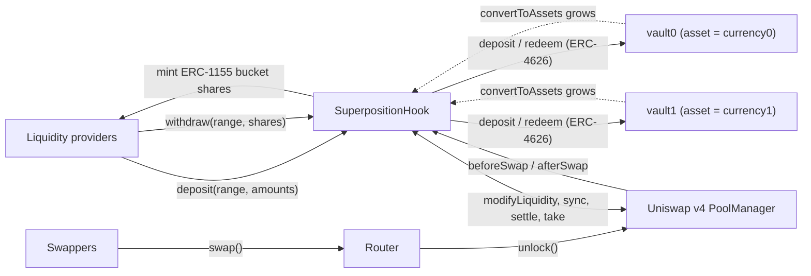
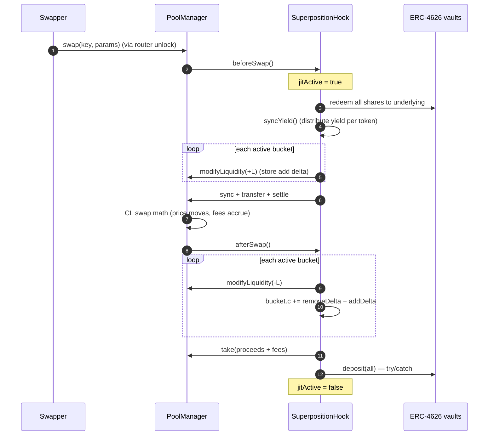
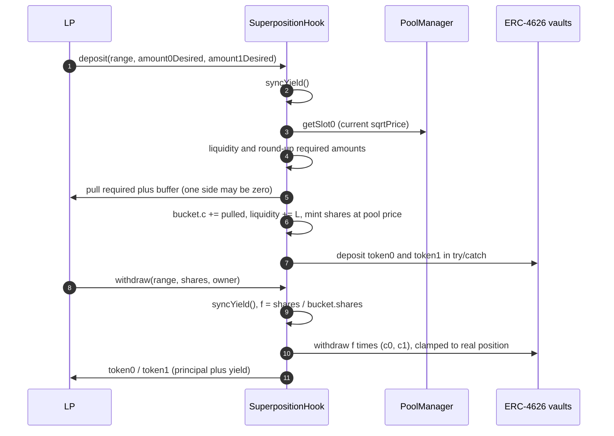
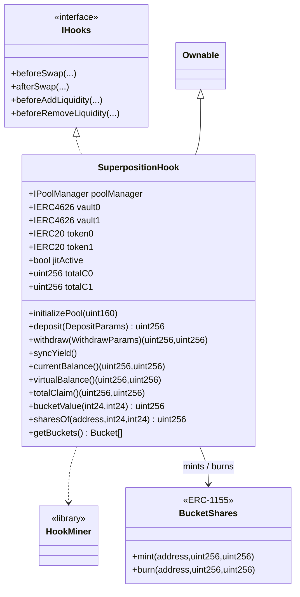

<p align="center">
  <strong>Superposition</strong><br/>
  Yield-backed concentrated liquidity on Uniswap v4
</p>

<p align="center">
  
  
  
  
  
</p>

> **Deployment target: Base Sepolia (chain id 84532) — TESTNET.** Fork-tested on Base mainnet too.

## What this is

A Uniswap v4 concentrated-liquidity hook that never leaves capital idle. Between swaps, **100% of
the pooled tokens sit in two external ERC-4626 lending vaults** — one vault per pool currency.
During a swap, the hook temporarily redeems those vaults, provides real v4 liquidity, executes the
swap, and re-deposits everything. The AMM sees a normal concentrated-liquidity pool; the capital
earns lending yield the whole time.

The hook is **protocol-agnostic and pair-agnostic**:

- It only talks **ERC-4626** (`asset`, `balanceOf`, `convertToAssets`, `deposit`, `withdraw`,
  `redeem`). There is no code path for any specific protocol.
- The pool's two currencies are read from the vaults themselves: `vault0.asset()` and
  `vault1.asset()`. No token is hard-coded, so **any pair** works (ETH/USDC, USDT/WBTC, ...).
- Each side can be any ERC-4626 vault: Morpho, Euler v2, Spark Savings, Yearn, or an **Aave
  ERC-4626 wrapper** — in any combination (`aave/morpho`, `morpho/euler`, ...).

## How it works, end to end

```
                 deposit                          swap (one transaction)
   LP ──▶ hook ──▶ vault0 / vault1      swapper ──▶ hook: redeem vaults → add v4 liquidity
                    (lending yield)                   → swap → remove liquidity → take
                                                      → re-deposit to vaults
```

**Deposits.** An LP picks a tick range. The hook pulls only the tokens that range needs at the
current price (a range fully below spot needs only token1; fully above spot only token0 → a real
limit order), mints ERC-1155 shares priced at the pool price, and deposits the tokens into the
vaults.

**Swaps.** Between swaps the pool holds zero real liquidity. `beforeSwap` redeems both vaults to
underlying, adds every active range as real v4 liquidity, and settles; the swap runs on normal v4
math; `afterSwap` removes the ranges, takes the proceeds and fees, and re-deposits everything. The
vaults are only unwound for the duration of one transaction, so their utilization is unaffected.

**Withdrawals.** Burning shares pays the bucket's pro-rata claim from the vaults plus any idle
balance. A bucket that is one-sided (range out of the money) withdraws one-sided: a resting token1
bid pays token1, or token0 once the price crossed.

**Yield.** Lending yield shows up as `convertToAssets(balanceOf)` growing. `syncYield()` distributes
that growth per token, pro-rata to every bucket's claim. Yield belongs only to the shares that were
present while it accrued: an atomic deposit → withdraw returns exactly the principal.

**No oracle.** Deposits are priced with the v4 pool price; one-sided buckets need no price at all.

---

## Table of contents

1. [Architecture](#1-architecture)
2. [Swap lifecycle (JIT)](#2-swap-lifecycle-jit)
3. [Deposit & withdraw](#3-deposit--withdraw)
4. [Buckets, shares and yield](#4-buckets-shares-and-yield)
5. [Limit orders](#5-limit-orders)
6. [Lending backends (ERC-4626)](#6-lending-backends-erc-4626)
7. [Uniswap v4 integration](#7-uniswap-v4-integration)
8. [Failure handling](#8-failure-handling)
9. [Contracts (UML)](#9-contracts-uml)
10. [API reference](#10-api-reference)
11. [Invariants](#11-invariants)
12. [Security](#12-security)
13. [Testing](#13-testing)
14. [Deployment](#14-deployment)
15. [Repository layout](#15-repository-layout)
16. [Limitations & roadmap](#16-limitations--roadmap)

---

## 1. Architecture



| Layer | Responsibility |
|---|---|
| `PoolManager` | v4 CL math, tick state, deltas, settlement |
| `SuperpositionHook` | vault, per-range buckets/shares, JIT lifecycle, ERC-4626 custody |
| `vault0` / `vault1` | lending yield on 100% of idle capital (any ERC-4626) |

---

## 2. Swap lifecycle (JIT)



Removing a bucket credits the hook a positive delta which `take` zeroes **before** the deposit leg
runs, so every `PoolManager` delta is settled before the vaults are touched. The deposit is
`try/catch`-wrapped: a failed deposit leaves idle tokens and never an unsettled delta.

---

## 3. Deposit & withdraw



---

## 4. Buckets, shares and yield

Each distinct tick range `(tickLower, tickUpper)` is a **bucket**:

```solidity
struct Bucket {
    int24   lower;
    int24   upper;
    uint128 liquidity;   // total v4 CL liquidity in this range
    uint256 shares;      // total bucket shares
    uint256 c0;          // token0 claim (underlying, incl. yield)
    uint256 c1;          // token1 claim (underlying, incl. yield)
    bool    active;
}
```

Ownership is the **`BucketShares` ERC-1155 token**, one id per range
(`uint256(keccak256(abi.encodePacked(lower, upper)))`). Shares are transferable and support
`setApprovalForAll`, so an approved delegate can `withdraw` on the owner's behalf.

**Minting (no oracle).** With `value(x0, x1, p) = x1 + x0 * p` and `p` the current pool price:

```
sharesMinted = value(pulled0, pulled1) * bucket.shares / value(bucket.c0, bucket.c1)
```

A deposit is priced with the same pool price as the bucket, so an atomic deposit → withdraw returns
exactly the principal and does not dilute existing yield.

**Yield.** `R = vault.convertToAssets(vault.balanceOf(hook)) + idle`. `syncYield()` distributes
`R − Σc` per token pro-rata to each bucket's claim:

```
yield0 = R0 - totalC0 ;  bucket.c0 += yield0 * bucket.c0 / totalC0
yield1 = R1 - totalC1 ;  bucket.c1 += yield1 * bucket.c1 / totalC1
```

An in-range two-sided LP earns both tokens in proportion to its composition; a one-tick token1
order earns token1 yield while it rests and token0 yield on the token it acquires after a fill; an
atomic entrant earns nothing.

**Swap PnL.** `beforeSwap` stores each bucket's add delta, `afterSwap` applies the removal delta
(`bucket.c += removeDelta + addDelta`), so principal change and fees land only on the bucket that
was crossed and `Σ c == R` after every cycle.

---

## 5. Limit orders

A range fully below spot needs only token1; a range fully above spot needs only token0. Because the
deposit pulls exactly the range-required amounts, a one-sided, out-of-range deposit is a genuine
limit order. A 1-tick-wide range is the most capital-efficient form; the pool's `tickSpacing` sets
the narrowest range (use `tickSpacing = 1` for a true 1-tick order).

```solidity
// token1-only bid just below spot (pair used only as an example)
hook.deposit(DepositParams({
    tickLower: lower,
    tickUpper: upper,          // upper < currentTick
    amount0Desired: 0,         // no token0
    amount1Desired: someToken1,
    amount0Min: 0, amount1Min: 0,
    recipient: alice
}));
```

When a swap pushes the price into the range, the bucket sells token1 and acquires token0; a
withdrawal then pays token0. The range *is* the order. The deposit pulls `required + DEPOSIT_BUFFER`
(1000 wei) to absorb ERC-4626 share/asset rounding.

---

## 6. Lending backends (ERC-4626)

The hook accepts **any ERC-4626 vault pair**. It only reads `asset()`, `balanceOf()`,
`convertToAssets()` and calls `deposit` / `withdraw` / `redeem`. There is no protocol-specific code.

| Backend | ERC-4626 | Notes |
|---|---|---|
| **Morpho** (MetaMorpho V1 / Vault V2) | yes | V2's `maxWithdraw` returns 0, so the hook clamps to `convertToAssets(balanceOf)` |
| **Euler v2** (EVault) | yes | ERC-4626 vault; supply-only use here |
| **Spark Savings** (`spUSDC`, `spUSDT`, …) | yes | `withdraw`/`redeem` can revert on insufficient idle liquidity |
| **Yearn v3** / other vaults | yes | any standard vault |
| **Aave v3** | wrapper only | the core aToken is **not** ERC-4626; use the official wrapper |

### Aave wrappers

Aave v3 ships ERC-4626 wrappers ("Wrapped Aave" / `StataToken`) that hold the aToken and grow in
value. Pre-deployed wrappers exist on 18 networks; for a listed asset without a wrapper, the
permissionless **`StataTokenFactory`** creates one:

```solidity
StataTokenFactory(factory).getStataToken(asset);        // existing wrapper, or address(0)
StataTokenFactory(factory).createStataTokens([asset]);  // create it, returns the wrapper
```

The core aToken (rebasing balance) is intentionally **not** accepted, which keeps every side on the
same, uniform ERC-4626 model (fixed shares, growing `convertToAssets`) on every chain.

If a chain/asset has **no** ERC-4626 vault at all, that token is not usable with the hook there —
a coverage limit, not a behavioural one.

---

## 7. Uniswap v4 integration

| Callback | Flag | Why |
|---|---|---|
| `beforeAddLiquidity` | `1 << 11` | reject anyone but the hook from LPing the pool |
| `beforeRemoveLiquidity` | `1 << 9` | same |
| `beforeSwap` | `1 << 7` | JIT materialize buckets, sync yield, settle |
| `afterSwap` | `1 << 6` | JIT remove buckets, attribute PnL/fees, re-deposit |

v4 decides which callbacks to invoke from the **low 14 bits of the hook address**, and
`PoolManager.initialize` reverts unless they match. `HookMiner` mirrors Uniswap's official
implementation (CREATE2 salt search with `Hooks.ALL_HOOK_MASK`). Deployment uses the deterministic
CREATE2 proxy (`0x4e59b448…4956C`).

All callbacks are `onlyPoolManager`; `beforeAddLiquidity` / `beforeRemoveLiquidity` additionally
require `sender == address(this)`. Deposits and withdrawals revert while `jitActive`.

---

## 8. Failure handling

A vault can reject a deposit (cap, paused market) or a withdrawal (illiquidity). Because all v4
deltas are settled before the deposit leg, a caught failure leaves idle ERC-20 in the hook — never
an unsettled delta. `currentBalance()` counts both vault positions and idle, and the next swap funds
the buckets from idle **plus** redeemed underlying. ERC-4626 rounding (deposit shares down,
withdraw assets up) is handled by the deposit buffer and the withdrawal clamp.

---

## 9. Contracts (UML)



---

## 10. API reference

### Constructor

```solidity
constructor(
    IPoolManager poolManager,
    IERC4626 vault0,        // asset() must be < asset() of vault1
    IERC4626 vault1,
    uint24 fee,
    int24 tickSpacing,
    address initialOwner
)
```

The currencies are `token0 = vault0.asset()` and `token1 = vault1.asset()`, required to be sorted
ascending. No token is passed explicitly, so the same contract serves any pair and any ERC-4626
backend.

### `deposit(DepositParams) → uint256 sharesMinted`

Computes range liquidity, pulls exactly the required tokens (+ buffer), updates the bucket, deposits
into the vaults (try/catch), and mints shares at the pool price. Reverts: `JitActive`,
`PoolNotInitialized`, `InvalidRange`, `NoLiquidity`, `Slippage`, `ZeroShares`.

### `withdraw(WithdrawParams) → (uint256 amount0, uint256 amount1)`

`syncYield`, burns `shareAmount / bucket.shares` of the bucket's `(c0, c1)`, reduces its liquidity,
and pays from the vaults + idle (clamped to the real position). `owner` is whose ERC-1155 shares are
burned; callable by the owner or an ERC-1155 operator. Reverts: `JitActive`, `ZeroShares`,
`InsufficientShares`, `NoBucket`, `NotAuthorized`.

### `syncYield()`

Realizes accrued vault yield into the buckets. Idempotent; safe off the JIT window.

### Views

| Function | Returns |
|---|---|
| `currentBalance()` | real `(token0, token1)` = vault positions + idle |
| `virtualBalance()` | bucket composition at the current price |
| `totalClaim()` | `(Σc0, Σc1)` |
| `bucketValue(lower, upper)` | bucket claim value in token1 terms |
| `sharesOf(user, lower, upper)` / `totalSharesOf(lower, upper)` | bucket share accounting |
| `getBuckets()` | array of `Bucket` |

### Events

```solidity
event Deposited(address indexed recipient, int24 lower, int24 upper,
                uint128 liquidity, uint256 amount0, uint256 amount1, uint256 shares);
event Withdrawn(address indexed owner, address indexed recipient, int24 lower, int24 upper,
                uint256 shares, uint256 amount0, uint256 amount1);
```

### Errors

`NotPoolManager`, `HookNotImplemented`, `OnlyHook`, `JitActive`, `NoLiquidity`, `Slippage`,
`InvalidRange`, `PoolNotInitialized`, `AlreadyInitialized`, `ZeroShares`, `InsufficientShares`,
`NoBucket`, `NotAuthorized`.

---

## 11. Invariants

- `totalC ≤ R` per token, where `R = vault position + idle`.
- `bucket.shares` is conserved by yield and swaps (only deposits/withdrawals change it), so value
  per share grows with yield.
- Swap PnL and fees land only on the bucket that was crossed.
- All hook `PoolManager` deltas are zero when the lock closes.
- No external oracle: valuation uses only the v4 pool price; one-sided buckets need none.

---

## 12. Security

| Concern | Mitigation |
|---|---|
| Yield theft by atomic join/exit | shares minted at the pool price; `c` does not move within a tx |
| Cross-range PnL leak | per-bucket add/remove deltas from the PoolManager |
| Re-entrancy during JIT | `jitActive` guard on `deposit` / `withdraw` / `syncYield` |
| Unauthorized LPing | `beforeAddLiquidity` / `beforeRemoveLiquidity` require `sender == hook` |
| Hook callback spoofing | every callback is `onlyPoolManager` |
| Vault deposit failure | `try/catch`; tokens stay idle and counted |
| Vault rounding | `DEPOSIT_BUFFER` + withdrawal clamped to the real position |
| Insolvency via accounting drift | cached totals only grow; payouts clamped to holdings |

---

## 13. Testing

`forge test` — **24 tests passing** across two forks with **real contracts** (Uniswap v4 + real
ERC-4626 vaults), no mocks except forced vault failures.

- `BaseSepoliaForkTest` — **the deployment target**, using Aave's real ERC-4626 wrappers.
- `SuperpositionHookBaseForkTest` — Base mainnet, including a **mixed** pool (Aave wrapper + Morpho)
  and a **factory-created** wrapper for an asset without one.

| Test | Proves |
|---|---|
| `test_fork_deposit_two_sided` | bucket liquidity, vault custody, zero idle |
| `test_fork_withdraw_returns_principal` / `_half` | one-sided-correct pro-rata exit |
| `test_fork_swap_jit_cycle` | full JIT swap, price move, capital back in the vaults |
| `test_fork_one_sided_usdc_limit_order` / `..._fills_on_cross` | one-sided limit orders |
| `test_fork_yield_accrual_and_atomic_exit_fairness` | atomic join/exit earns no yield |
| `test_fork_deposit_survives_vault_failure` | try/catch fallback with idle tokens |
| `test_fork_partial_vault_deposit_stays_correct` | mixed real + virtual after a failed deposit |
| `test_fork_mixed_vaults_aave_morpho` | one Aave side, one Morpho side, same hook |
| `test_fork_factory_creates_vault_for_unwrapped_asset` | create a wrapper via `StataTokenFactory` and use it |
| `test_fork_multi_lp_full_exit`, `test_fork_delegate_withdraw` | lifecycle + ERC-1155 operator |
| `test_non_manager_hook_calls_revert`, `test_direct_lp_modify_reverts` | access control |

---

## 14. Deployment

> **TESTNET.** Target is Base Sepolia (chain id 84532); the script reverts on any other chain.

```bash
forge script script/DeployHook.s.sol --rpc-url base_sepolia --broadcast --private-key <KEY>
```

**Base Sepolia (84532, TESTNET)**

| Item | Address |
|---|---|
| v4 `PoolManager` | `0x05E73354cFDd6745C338b50BcFDfA3Aa6fA03408` |
| vault0 (Wrapped Aave WETH) | `0xde7820fFb73059608928cb9e29F6EB1369Ad1342` |
| vault1 (Wrapped Aave USDC) | `0xf430cb6E2b85f99222fBFA6dFEa18Ff60FA6B32a` |
| WETH / USDC (underlyings) | `0x4200…0006` / `0xba50Cd2A20f6DA35D788639E581bca8d0B5d4D5f` |
| `StataTokenFactory` | `0x4Afb5ADe7Bd7a670B61f303ab0C740eE8350918f` |
| CREATE2 deployer | `0x4e59b44847b379578588920cA78FbF26c0B4956C` |

**Base mainnet (8453) reference**

| Item | Address |
|---|---|
| vault0 (Wrapped Aave WETH) | `0xe298b938631f750DD409fB18227C4a23dCdaab9b` |
| vault1 (Wrapped Aave USDC) | `0xC768c589647798a6EE01A91FdE98EF2ed046DBD6` |
| Morpho USDC (mixed test) | `0xBEEFE94c8aD530842bfE7d8B397938fFc1cb83b2` |
| `StataTokenFactory` | `0x78d33BF0014ab169725F2Ea5a62b200F2977faeE` |

Any ERC-4626 pair can be used; fee/spacing are configurable (500 / 10 by default). Chainlink is
used **only in the deploy script** to pick the starting price; the hook never reads an oracle.

## Build

```bash
git clone --recursive <repo>
cd <repo>
forge build
forge test
```

---

## 15. Repository layout

```
src/
  SuperpositionHook.sol        hook + vault (buckets, JIT, ERC-4626, yield)
  BucketShares.sol             ERC-1155 share token, one id per range
  libraries/
    HookMiner.sol              CREATE2 salt search for v4 permission bits
  interfaces/
    IAggregatorV3.sol          Chainlink feed subset (deploy scripts only)
test/
  BaseSepoliaFork.t.sol            Base Sepolia TESTNET fork suite (deployment target)
  SuperpositionHookBaseFork.t.sol  Base mainnet fork suite (mixed + factory-created vault)
  LiquidityAmounts.t.sol           canonical periphery math
  helpers/TestSwapRouter.sol       minimal v4 swap router for tests
script/
  BaseSepoliaAddresses.sol     verified Base Sepolia (TESTNET) addresses
  DeployHook.s.sol             deterministic testnet deployment (chain-guarded)
```

---

## 16. Limitations & roadmap

- **Vault coverage.** A token is usable only where an ERC-4626 vault for it exists (Aave wrapper,
  Morpho, Euler, Spark, Yearn, or one created via `StataTokenFactory`).
- **Pool-price valuation.** Manipulating the pool right before a deposit is a residual concern for
  two-sided in-range buckets (one-sided buckets need no price); a TWAP would harden it.
- **Partial vault deposit** up to a cap (instead of all-or-nothing).
- **Multi-pair factory** and an **external adapter** exposing each bucket position.
- Large exits bounded by vault liquidity may need batching.

---

## License

MIT
